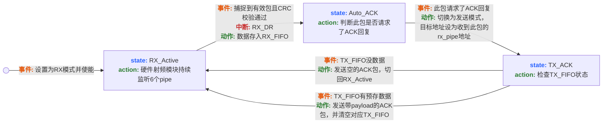
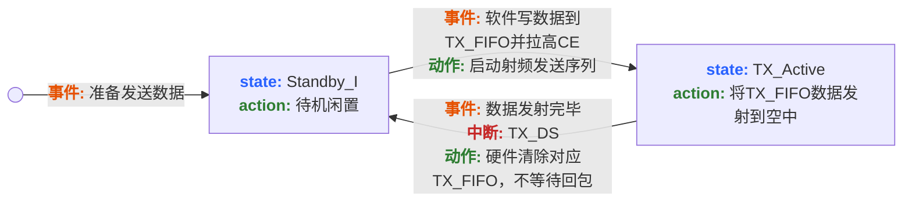
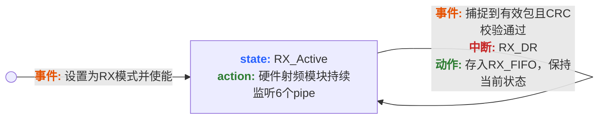

# RF Driver API Documentation

BK24系列2.4G无线芯片HAL驱动

---

## 一、硬件工作原理

### 1.1 半双工特性

RF芯片工作在半双工模式：**同一时间只能发送或接收，不能同时进行。**

---

### 1.2 工作模式对比

| 模式 | 可靠性 | 速度 | 适用场景 |
|------|--------|------|---------|
| **ACK模式** | 高（自动重传） | 慢 | 需要确认的指令 |
| **NoACK模式** | 低（无确认） | 快 | 遥控器实时数据 |

---

## 二、ACK模式硬件状态机

### 2.1 发送端状态机

```mermaid
flowchart LR
    Start(( )) -->|<b><font color=#E65100>事件:</font></b> 准备发送数据| S1

    S1["<b><font color=#2962FF>state:</font></b> Standby_I<br><b><font color=#2E7D32>action:</font></b> 待机闲置"]
    
    S1 -->|<b><font color=#E65100>事件:</font></b> 软件写数据到TX_FIFO并拉高CE<br><b><font color=#2E7D32>动作:</font></b> 启动射频发送序列| S2

    S2["<b><font color=#2962FF>state:</font></b> TX_Active<br><b><font color=#2E7D32>action:</font></b> 将TX_FIFO数据发射到空中"]

    S2 -->|<b><font color=#E65100>事件:</font></b> 数据发射完毕<br><b><font color=#2E7D32>动作:</font></b> 自动切RX，开启Pipe0监听ACK| S3

    S3["<b><font color=#2962FF>state:</font></b> Wait_ACK<br><b><font color=#2E7D32>action:</font></b> 启动ARD定时器，持续监听Pipe0"]

    S3 -->|<b><font color=#E65100>事件:</font></b> 收到有效ACK&#40;无payload&#41;<br><b><font color=#C62828>中断:</font></b> TX_DS<br><b><font color=#2E7D32>动作:</font></b> 硬件自动清除TX_FIFO| S1
    
    S3 -->|<b><font color=#E65100>事件:</font></b> 收到有效ACK&#40;带payload&#41;<br><b><font color=#C62828>中断:</font></b> TX_DS + RX_DR<br><b><font color=#2E7D32>动作:</font></b> 数据存RX_FIFO，清TX_FIFO| S1

    S3 -->|<b><font color=#E65100>事件:</font></b> ARD时间内未收到ACK&#40;超时&#41;<br><b><font color=#2E7D32>动作:</font></b> 检查内部自动重传计数器| S4

    S4["<b><font color=#2962FF>state:</font></b> Check_Retry<br><b><font color=#2E7D32>action:</font></b> 判断是否达到最大重传次数ARC"]

    S4 -->|<b><font color=#E65100>事件:</font></b> 已重传次数 &lt; ARC<br><b><font color=#2E7D32>动作:</font></b> 提取TX_FIFO数据自动重新发射| S2
    
    S4 -->|<b><font color=#E65100>事件:</font></b> 已重传次数 == ARC<br><b><font color=#C62828>中断:</font></b> MAX_RT<br><b><font color=#2E7D32>动作:</font></b> 停止发送，需软件手动清空TX_FIFO| S1
```



**状态转换表：**

| 当前状态 | 触发条件/事件 | 执行主体 | 动作与产生的中断 | 下一状态 |
|---------|--------------|---------|-----------------|---------|
| **Standby-I** | 软件调用发送API，向TX FIFO写入数据，拉高CE | HAL库 | 启动发送序列 | **TX_Active** |
| **TX_Active** | 射频模块完成空中数据发射 | 底层硬件 | 自动切换为接收模式，开启Pipe0监听 | **Wait_ACK** |
| **Wait_ACK** | 事件A：收到有效ACK，且不带Payload | 底层硬件 | 产生TX_DS中断，清除TX FIFO | **Standby-I** |
| **Wait_ACK** | 事件B：收到有效ACK，且带Payload | 底层硬件 | 产生TX_DS + RX_DR中断，数据存入RX FIFO | **Standby-I** |
| **Wait_ACK** | 事件C：经过ARD时间，未收到ACK | 底层硬件 | 检查重传次数是否 < ARC | **Check_Retry** |
| **Check_Retry** | 重传计数器 < ARC | 底层硬件 | 自动发起重传 | **TX_Active** |
| **Check_Retry** | 重传计数器 == ARC（达到上限） | 底层硬件 | 产生MAX_RT中断 | **Standby-I** ⚠️ TX FIFO需手动清除 |

**关键点：**
- **Pipe0地址必须与TX地址相同**：发送端在Wait_ACK状态下，硬件自动切换到RX模式，监听Pipe0接收ACK
- **ACK回包地址**：接收端收到数据后，自动向数据包的源地址（即发送端的TX地址）回复ACK
- **为什么是Pipe0**：硬件设计规定，ACK模式下Pipe0专用于接收ACK包

### 2.2 接收端状态机



**状态转换表：**

| 当前状态 | 触发条件/事件 | 执行主体 | 动作与产生的中断 | 下一状态 |
|---------|--------------|---------|-----------------|---------|
| **Standby-I** | 置位PRIM_RX=1并拉高CE | HAL库 | 进入持续监听状态 | **RX_Active** |
| **RX_Active** | 天线捕捉到有效数据包，CRC校验通过 | 底层硬件 | 产生RX_DR中断，数据存入RX FIFO | **Auto_ACK** |
| **Auto_ACK** | 判断此包请求了ACK回复 | 底层硬件 | 自动切换为发送模式 | **TX_ACK** |
| **TX_ACK** | 检查TX FIFO：为空（无应用层数据） | 底层硬件 | 发送空ACK包 | **RX_Active** |
| **TX_ACK** | 检查TX FIFO：有数据（预先由W_ACK_PAYLOAD写入） | 底层硬件 | 发送带Payload的ACK包，清除对应TX FIFO | **RX_Active** |

**关键点：**
- 接收端在RX_Active状态下持续监听
- 收到数据后自动回复ACK（无需软件干预）
- ACK可携带数据（需提前写入TX FIFO）

---

## 三、NoACK模式硬件状态机

### 3.1 发送端状态机



**状态转换表：**

| 当前状态 | 触发条件/事件 | 执行主体 | 动作与产生的中断 | 下一状态 |
|---------|--------------|---------|-----------------|---------|
| **Standby-I** | 软件调用发送API，向TX FIFO写入数据，拉高CE | HAL库 | 启动发送序列 | **TX_Active** |
| **TX_Active** | 射频模块完成空中数据发射 | 底层硬件 | 产生TX_DS中断标志位 | **Standby-II**（CE仍高）或 **Standby-I**（CE拉低） |
| 任何状态 | 软件清除TX_DS标志位 | HAL库 | 准备下一次发送 | **Standby-I** |

**与ACK模式的区别：**
- 无Wait_ACK状态：发送完立即产生TX_DS中断
- 无重传机制：不关心对方是否收到
- 速度更快：无需等待ACK

### 3.2 接收端状态机



**状态转换表：**

| 当前状态 | 触发条件/事件 | 执行主体 | 动作与产生的中断 | 下一状态 |
|---------|--------------|---------|-----------------|---------|
| **Standby-I** | 置位PRIM_RX=1并拉高CE | HAL库 | 进入持续监听状态 | **RX_Active** |
| **RX_Active** | 天线捕捉到有效数据包，CRC校验通过 | 底层硬件 | 产生RX_DR中断，数据存入RX FIFO | **RX_Active** |

**与ACK模式的区别：**
- 无Auto_ACK和TX_ACK状态：不回复ACK
- 持续监听：收到数据后立即回到RX_Active

---

## 四、驱动设计

### 4.1 中断管理

驱动提供统一的中断处理入口，自动分发到用户回调：

```c
// 在硬件中断服务函数中调用
void HAL_RF_IRQ_Handler(RF_HandleTypeDef *hrf) {
    uint8_t status = TRX_IRQ_STATUS;

    if (status & IRQ_RX_DR_MASK) {
        // 接收完成
        if (hrf->Params.IRQ.RxDR.enable && hrf->Params.IRQ.RxDR.user_cb) {
            hrf->Params.IRQ.RxDR.user_cb(hrf);
        }
        HAL_RF_ClearIRQFlags(hrf, IRQ_RX_DR_MASK);
    }

    if (status & IRQ_TX_DS_MASK) {
        // 发送完成
        if (hrf->Params.IRQ.TxDS.enable && hrf->Params.IRQ.TxDS.user_cb) {
            hrf->Params.IRQ.TxDS.user_cb(hrf);
        }
        HAL_RF_ClearIRQFlags(hrf, IRQ_TX_DS_MASK);
    }

    if (status & IRQ_MAX_RT_MASK) {
        // 最大重传
        if (hrf->Params.IRQ.MaxRT.enable && hrf->Params.IRQ.MaxRT.user_cb) {
            hrf->Params.IRQ.MaxRT.user_cb(hrf);
        }
        HAL_RF_ClearIRQFlags(hrf, IRQ_MAX_RT_MASK);
        __HAL_RF_CMD_FLUSH_TXFIFO(); // 清除死数据
    }
}
```

### 4.2 地址配置规则

```
发送端配置：
  TxAddress = {0x11, 0x22, 0x33, 0x44, 0x55}
  RxPipes[0].Address = {0x11, 0x22, 0x33, 0x44, 0x55}  // 必须相同！

接收端配置：
  RxPipes[0].Address = {0x11, 0x22, 0x33, 0x44, 0x55}  // 接收发送端数据
```

**为什么Pipe0地址要与TX地址相同？**
- ACK模式下，发送端发送数据后自动切换到RX模式
- 硬件固定使用Pipe0监听ACK包
- 接收端回复ACK时，目标地址就是发送端的TX地址
- 因此Pipe0地址必须与TX地址匹配才能收到ACK


## 五、API参考

### 5.1 初始化
```c
HAL_StatusTypeDef HAL_RF_Init(RF_HandleTypeDef* hrf, RF_ConfgTypeDef *Init);
```

### 5.2 发送
```c
// NoACK模式（快速，无确认）
HAL_StatusTypeDef HAL_RF_Transmit_NoACK(RF_HandleTypeDef *hrf, uint8_t *pData, uint8_t Size);

// ACK模式（可靠，自动重传）
HAL_StatusTypeDef HAL_RF_Transmit_ACK(RF_HandleTypeDef *hrf, uint8_t *pData, uint8_t Size);
```

### 5.3 接收
```c
// 读取接收数据（在RX_DR回调中调用）
HAL_StatusTypeDef HAL_RF_Receive(RF_HandleTypeDef *hrf, uint8_t *pData, uint8_t* Size);
```

### 5.4 控制
```c
// 模式切换
HAL_StatusTypeDef HAL_RF_SetRxMode(RF_HandleTypeDef *hrf);
HAL_StatusTypeDef HAL_RF_SetTxMode(RF_HandleTypeDef *hrf);

// 频道设置（0~125）
void HAL_RF_SetChannel(RF_HandleTypeDef *hrf, uint8_t channel);

// 地址设置
HAL_StatusTypeDef HAL_RF_SetTxAddress(RF_HandleTypeDef *hrf, uint8_t *dev_addr, uint8_t length);
HAL_StatusTypeDef HAL_RF_SetRxAddress(RF_HandleTypeDef *hrf, uint8_t pipe, uint8_t *dev_addr, uint8_t length);
```

### 5.5 中断处理
```c
// 在硬件中断服务函数中调用
void HAL_RF_IRQ_Handler(RF_HandleTypeDef *hrf);
```


## 六、使用示例

### 6.1 发送端（NoACK模式）

```c
RF_HandleTypeDef hrf;

void rf_init(void) {
    RF_ConfgTypeDef config = {
        .Mode = MODE_TX,
        .DataRate = BPS_1M,
        .Channel = 40,
        .Protocol = {
            .AddressWidth = 5,
            .TxAddress = {0x11, 0x22, 0x33, 0x44, 0x55},
            .Support_NoAck = 1,
        },
    };
    HAL_RF_Init(&hrf, &config);
}

void send_data(void) {
    uint8_t data[10] = {0x01, 0x02, 0x03};
    HAL_RF_Transmit_NoACK(&hrf, data, 10);
}
```

### 6.2 接收端（中断模式）

```c
void rx_callback(RF_HandleTypeDef *hrf) {
    uint8_t buf[32];
    uint8_t len;
    HAL_RF_Receive(hrf, buf, &len);
    // 处理数据
}

void rf_init(void) {
    RF_ConfgTypeDef config = {
        .Mode = MODE_RX,
        .DataRate = BPS_1M,
        .Channel = 40,
        .Protocol = {
            .AddressWidth = 5,
            .RxPipes[0] = {
                .PipeNum = 0,
                .Enable = 1,
                .AutoAck = 0,
                .EnDynamicPayload = 1,
                .Address = {0x11, 0x22, 0x33, 0x44, 0x55},
            },
        },
        .IRQ.RxDR.enable = 1,
        .IRQ.RxDR.user_cb = rx_callback,
    };
    HAL_RF_Init(&hrf, &config);
}
```


## 七、关键注意事项

1. **Pipe0地址规则**：ACK模式下必须与TX地址相同
2. **模式切换**：必须调用API函数，不能只改寄存器位
3. **MAX_RT处理**：达到最大重传后，TX FIFO需手动清除（驱动已自动处理）
4. **动态载荷**：需同时使能总开关（FEATURE.EN_DPL）和通道开关（DYNPD）
5. **中断清除**：驱动自动清除中断标志，用户无需手动清除

---

## 版本历史

- **v1.0** (2026-03-21) - BK24芯片HAL驱动
